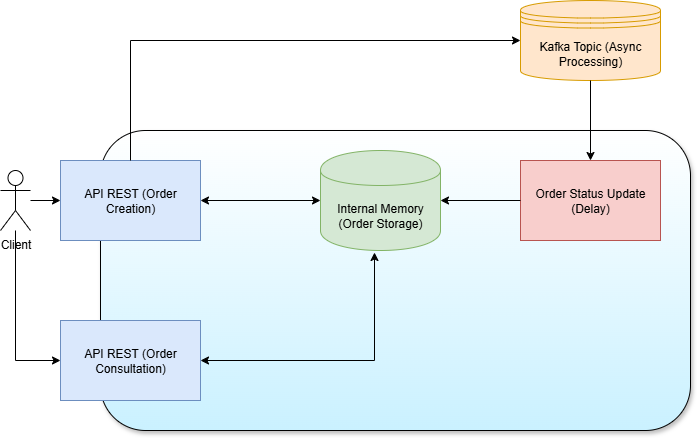

# Desafio - Processamento Assíncrono

[](https://kotlinlang.org/)
[](https://www.java.com/)
[](https://gradle.org/)
[](https://spring.io/projects/spring-boot)
[](https://kafka.apache.org/)
[](https://www.docker.com/)


Este projeto é uma aplicação Kotlin/Spring Boot que faz o processamento assíncrono de pedidos utilizando Kafka como sistema de mensageria. O
contéudo de interesse está no master branch deste projeto.

## Funcionamento Geral

A aplicação trata requisições de criação de pedidos via API REST (cada requisição contem um identificador de cliente e uma lista de itens).
Os pedidos criados são armazenados numa memória interna sob um status PENDING e um identificador único. Na sequencia uma mensagem kafka é
enviada num tópico para processamento assíncrono (com um delay artificial) que atualiza o status do pedido para PROCESSED. O status do
pedido pode ser consultado posteriormente por um endpoint de consultação.



Principais componentes:

- **Producer**: Envia mensagens identificando os pedidos para o Kafka.
- **Consumer**: Consome as mensagens do tópico e processa os pedidos (atualização do status).
- **API REST**: Permite criar pedidos e consultar o status.

## Como rodar localmente

### Pré-requisitos

- Java 17+
- Docker e Docker Compose
- Gradle (ou utilize o wrapper `./gradlew`)

### Clonar o repositório

Clone o repositório para sua máquina local:

```
git clone https://gitlab.com/btg9941127/asynchronous-project.git 
```

### Configuração

#### Delay

É possível configurar um delay artificial para o processamento dos pedidos. Para isso, edite o arquivo `src/main/resources/application.yaml`
e ajuste a propriedade

```yaml
kafka:
  processing:
    delay: <delay_in_milliseconds>
``` 

com o valor desejado em milissegundos. A ausência dessa propriedade implica em um delay de 0 segundos (sem delay). O master está configurado
com um delay de 20000 (20 segundos).

#### Nome do tópico

Pode-se configurar o nome do tópico Kafka através da propriedade

```yaml
kafka:
  topics:
    order-creation: <topic_name>
```

### 1. Subir o Kafka com Docker Compose

No diretório `misc/`, execute:

```bash
cd misc
docker-compose up -d
```

Isso irá iniciar um broker Kafka necessário para o bom funcionamento da aplicação.

### 2. Subir a aplicação

#### via Gradle wrapper

Na raiz do projeto, execute:

```bash
./gradlew bootRun
```

#### via Java command

Na raiz do projeto, execute:

```bash
./gradlew assemble
```

E depois:

```bash
cd build/libs
java -jar asynchronous-process-0.0.1-SNAPSHOT.jar
```

A aplicação estará disponível em `http://localhost:8080`.

### 3. Testar a API

#### via Postman

Pode-se utilizar o arquivo `misc/postman_collection.json` para importar no Postman e testar os endpoints disponíveis.

#### via cURL

Alternativamente, para criar um pedido, execute o seguinte comando cURL:

```curl
curl --request POST \
  --url http://localhost:8080/api/pedidos \
  --header 'content-type: application/json' \
  --data '{
  "clientId": "C003",
  "items": [
    {
      "description": "item1"
    },
    {
      "description": "item2"
    }
  ]
}'
```

Para resgatar um pedido, utilize:

```curl
curl --request GET \
  --url http://localhost:8080/api/pedidos/f8a04f00-4574-4674-acbb-23c7a0182300
```

usando o identificador único do seu pedido obtido na resposta da requisição de criação.

### 4. Parar os serviços

Para parar o Kafka:

```bash
cd misc
docker-compose down
```

## Rodar os testes

Para rodar os testes unitários e de integração, execute:

```bash 
./gradlew test
```

Os testes de integração usam um testcontainer Kafka. Assim é necessário estar com o Docker (ou semelhante) rodando para poder executar os
testes com sucesso.

---


